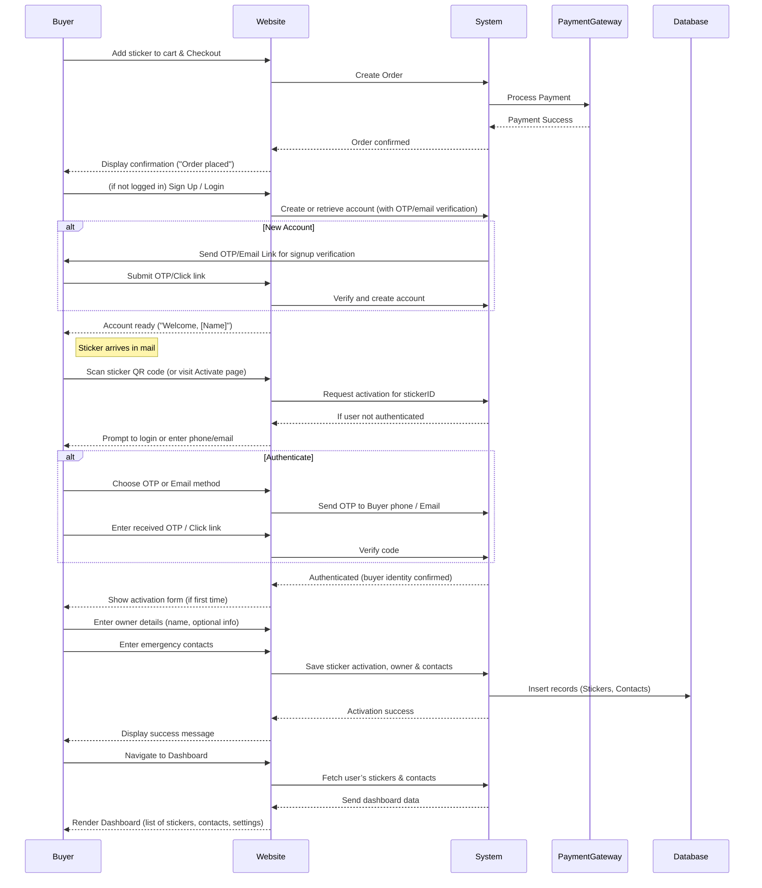

## Activation Approaches Comparison  

We compare several ways to authenticate/activate the sticker. Key criteria: ease-of-use (UX), security, and implementation complexity.  

| **Activation Method**               | **Pros**                                                    | **Cons**                                                         | **Security**                                   | **UX Considerations**                                      |
|-------------------------------------|-------------------------------------------------------------|------------------------------------------------------------------|-----------------------------------------------|-----------------------------------------------------------|
| **SMS OTP to Buyer’s Phone**        | Instant, leverages existing purchase info; user only needs to tap OTP.   | Inconvenient if user scans on a different device; phone might be lost or SIM-swapped.   | Moderate. SMS OTP is common, but vulnerable to SIM attacks. Must limit attempts. | User stays on phone that made purchase – seamless if same device. Requires waiting for code. |
| **SMS OTP to Any Phone (User-provided)** | Flexible (user can enter any number); ensures correct “owner” is verified. | Extra step to enter number; potential friction.   | Same SMS vulnerabilities. Avoid if number reused maliciously. | Slightly more friction (entering number, waiting on another device), but covers use-cases like gifting a sticker.|
| **Email Magic Link/OTP**            | Works across devices; no phone needed.                      | Slower (email delays); user must switch apps; might hit spam.    | Moderate. Security depends on email provider; links could be forwarded.   | Not as instant. Can continue to limited dashboard while waiting for link. |
| **QR Scan Only (no login)**        | Fastest path: just scan and fill info. No account needed.    | No account linkage; anyone with the sticker could re-activate or overwrite data.  | Poor. No proof of ownership – risks someone else claiming the sticker.       | Very simple for first scan, but breaks trust since no way to manage later. |
| **QR + Code (Manual Key)**         | Ties activation to physical sticker (need the code); no separate OTP. | If code is obtained by others (e.g. photographing sticker), can be misused.   | Low. Code acts like a PIN – better than nothing but easily leaked.  | Adds step: user must find and type the code. Might confuse non-tech users.  |
| **Pre-Login “Add Sticker” (Account first)** | User already logged in, then enters/scans code.   | Requires user to have an account *before* receiving sticker. | Good, relies on account security (password, MFA).   | Slightly more work upfront (creating account earlier), but gives best management experience. |

- *Recommendation:* Offer **SMS OTP** by default (it’s most user-friendly) and fall back to email if needed. Always require **some verification** – we should avoid a “scan-only” path without an account. Using the user’s phone from purchase (if available) can streamline activation, but always allow entering a new phone. In all cases, proceed to collect details only after authentication. This balances security (verifying ownership) with UX.

## Data Model (Database Schema)  

We recommend the following tables and fields. Primary keys (`id`) should be random/UUIDs to prevent guessing. Timestamps (`created_at`, `updated_at`) track history.  

**Users Table:** (stores each account/buyer)  
| Column         | Type         | Description                              |
| -------------- | ------------ | ---------------------------------------- |
| user_id (PK)   | UUID/varchar | Unique user identifier (random UUID) |
| name           | varchar      | User’s full name                         |
| email          | varchar      | Email (unique); used for login or contact |
| phone          | varchar(15)  | Primary phone number (unique)            |
| password_hash  | varchar      | (optional) Hashed password if using password login |
| created_at     | datetime     | Account creation timestamp               |
| updated_at     | datetime     | Last profile update time                 |

**Stickers Table:** (each sticker sold)  
| Column            | Type         | Description                              |
| ----------------- | ------------ | ---------------------------------------- |
| sticker_id (PK)   | varchar      | Unique sticker/QR code ID (printed on sticker) |
| owner_user_id (FK)| UUID        | References Users.user_id (who owns it)   |
| activated        | boolean      | Activation status (true/false)           |
| activated_at      | datetime     | When it was activated                    |
| deactivated_at    | datetime     | If transferred/lost, when flagged inactive |
| created_at        | datetime     | When sticker was sold/recorded           |
| updated_at        | datetime     | Last detail update                       |

**EmergencyContacts Table:** (contacts for alerts)  
| Column        | Type        | Description                                  |
| ------------- | ----------- | -------------------------------------------- |
| contact_id (PK)| UUID/varchar| Unique contact ID                            |
| sticker_id (FK)| varchar    | References Stickers.sticker_id               |
| name          | varchar     | Contact’s name                               |
| phone         | varchar     | Contact’s phone number                       |
| relationship  | varchar     | E.g. “Spouse”, “Parent”                       |
| added_at      | datetime    | When contact was added                       |
| updated_at    | datetime    | When contact info was last changed           |

*(Optional) ScanLogs Table:* For analytics – records each time a sticker is scanned. Fields: log_id, sticker_id, scanned_at, location (if available). This helps show “last scan” on the dashboard and analytics. 

**Security Notes:** Encrypt or hash sensitive fields (e.g. passwords). PCI compliance governs any payment info (though that may be handled by a payment gateway). Do not store full OTP codes. Comply with DPDP/GDPR by keeping personal data minimal, and supporting deletion (“right to be forgotten”).  

## Sequence Diagram (Activation Flow)  
Below is a Mermaid sequence diagram of the main interactions (purchase to activation). It shows the Buyer (user), the Website/App (front-end), and the Backend System. This includes branches for login vs registration and OTP verification.  

This illustrates the **decision branches** (new vs existing account, OTP vs email) and the data flow. In practice, the Website and System may be unified (web frontend & backend), but we separate for clarity.  

## Dashboard Wireframe Description  

The user’s **Dashboard** (web/app) is the central hub to manage stickers and contacts. A clean layout might include:  

- **Header/Toolbar:** Shows user name, notifications icon (e.g. pending scans), and a “+ Add Sticker” button. Also links to Settings and Logout.  
- **Sidebar (or top tabs):** Sections: **My Stickers**, **Emergency Contacts**, **Account Settings**, **Support**. (Or if one section view, a button to toggle to contacts.)  
- **Main Area (My Stickers):** A list or grid of sticker cards. Each card displays:
  - *Sticker ID/Name* (possibly user-customizable alias, like “Car Sticker”)
  - *Status:* Active (green) or Inactive (grey).
  - *Activated On:* date.
  - *Last Scan:* e.g. “3 days ago” or “Never”.
  - *Actions:* [Edit Details], [Edit Contacts], [Share Sticker], [Deactivate]. Icons or small buttons.  
  Users click **Edit Details** to change owner info or sticker label. **Edit Contacts** opens the contact list for that sticker. **Share Sticker** could copy the sticker’s unique activation URL (for lending or backup).  

- **Emergency Contacts Section:** If separate, shows a table of all contacts (optionally grouped by sticker). Columns: Name, Phone, Sticker (which sticker they belong to). Buttons to **Add Contact** or **Edit**. Adding opens a modal form (“Name, Relationship, Phone”). Inline validation as user types.  

- **Account Settings:** Form to update user name, email, phone, and change password. Option to set 2FA. Also links to Privacy Policy, and a “Delete Account” action.  

- **Footer/Policy Links:** Always visible: “Privacy Policy” and “Terms of Service” links.  

*Mockup Style:* Use a clean, modern UI with consistent branding (RepiQR logo/colors). Use cards or table stripes for readability. For mobile, a stacked view: Sticker list first, then contacts. Include tooltips or help icons (e.g. “?”) for fields like “QR Code: a unique code on your sticker”.  

> *Example Scenario:* On login, the user sees one sticker card: “Car Sticker #1234 – Active since 2026-07-30”. They click **Edit Contacts**, and a side panel slides out listing “Mother (98765…), Father (91234…)” with [Delete] icons. They hit “Add Contact”, type a name and number, and hit Save. The list updates immediately.  

This intuitive design lets users quickly verify and update their emergency info. Clear button labels and confirmation dialogs ensure users don’t lose data accidentally. Feedback messages (snackbars) confirm actions (“Contact added!”). The overall dashboard flow adheres to UX best practices for usability and trust (see Authgear and Linkbreakers on clear labels and minimal steps).

## Implementation Checklist & Roadmap  

**Immediate (High Priority):**  
- **User Account & Authentication:** Implement user signup/login with phone/email (OTP or password). Effort: Medium. Use a proven identity solution or framework. Ensure phone/email uniqueness. Add SSL for all auth pages.  
- **E-commerce Checkout:** Set up product pages and cart with payment gateway (support multiple India options: UPI, cards, wallets). Effort: Medium. Optimize checkout form (minimize fields, auto-fill). Mark as high priority to capture sales.  
- **Sticker Order Management:** Generate unique `sticker_id` codes for each order. Link orders to user accounts. Effort: Low. Simple DB operations.  
- **Activation Flow:** Build the activation endpoint that handles QR scans. This includes redirect logic to login/OTP and then to data collection form. Effort: Medium.  
- **OTP/Email Integration:** Integrate SMS (Twilio/Notifyre) and email services. Ensure OTP expiry and rate-limiting. Effort: Medium. Critical for trust/security.  
- **Minimal Data Collection Forms:** Design the short registration and contact forms as per UX guidelines. Implement front-end validation and privacy consent checkbox. Effort: Low.  

**Short-Term (Next 1-2 Months):**  
- **Dashboard Front-End:** Build the user dashboard (stickers list, contact list, settings). Effort: High (involves multiple UI components). Focus on a responsive, branded design.  
- **Database Schema & Backend Logic:** Create tables for Users, Stickers, Contacts (as above). Implement CRUD APIs for adding/editing stickers and contacts. Effort: Medium. Ensure referential integrity (FKs) and indexing.  
- **Privacy & Compliance:** Draft and publish Privacy Policy. Add consent flows on forms. Implement data retention and delete-account features (DPDP/GDPR compliance). Effort: Low/Medium. Legal review recommended.  
- **Email/SMS Notifications:** Automate sending activation confirmations and alerting contacts. Effort: Low. Ensure opt-in and opt-out as required.  
- **Error Handling & UX polish:** Thoroughly test flows. Add user-friendly error messages and loading states. Effort: Medium.  

**Medium-Term (3–6 Months):**  
- **Multi-Sticker Support:** Enhance the dashboard to handle multiple stickers per user. Implement “Add Sticker” in the dashboard. Effort: Medium.  
- **Transfer & Recovery Flows:** Build UI for transferring ownership and recovering accounts (lost phone). Effort: Medium.  
- **Analytics & Reporting:** Log scan events (count, time, location). Show “Scan History” or map if applicable. Effort: Low. Use for future features/marketing.  
- **Admin Panel:** Develop an internal admin interface to view users/orders/stickers, and assist with transfers or deactivations. Effort: Medium. (Could be simplified at launch and expanded later.)  

**Long-Term (6+ Months):**  
- **Mobile App (if not already):** A native app for Android/iOS (they mentioned it’s under development). This would enhance UX (access to contacts, notifications). Effort: High.  
- **Additional Auth Options:** E.g. “Login with Google/WhatsApp” or passkeys, once user base grows. Effort: Low to Medium.  
- **Advanced Features:** E.g. SOS button in app, geolocation alerts, subscription management, etc. Effort: High (depending on scope).  

Each feature is marked **Effort:** Low/Med/High based on development complexity. We prioritize core flows (account auth, activation, dashboard CRUD) first, as these directly impact user conversion and trust. Subsequent features (analytics, admin tools) are valuable but lower priority for MVP. Throughout, iterative testing and user feedback should guide refinements.  

**Summary:** By following this roadmap—building from purchase to activation to dashboard—we ensure a robust, user-friendly system that upholds security and privacy standards (e.g. DPDP Act’s consent and purpose limitations) while delivering a premium user experience focused on ease of activation and management.

Unknown Person
      │
      ▼
 Scan RepiQR
      │
      ▼
 Browser asks Location Permission
      │
      ▼
 Send GPS → RepiQR Backend
      │
      ├── WhatsApp API
      ├── SMS Gateway
      ├── Voice API
      └── Push Notification
             │
             ▼
Emergency Contacts

Sender:
✓ RepiQR