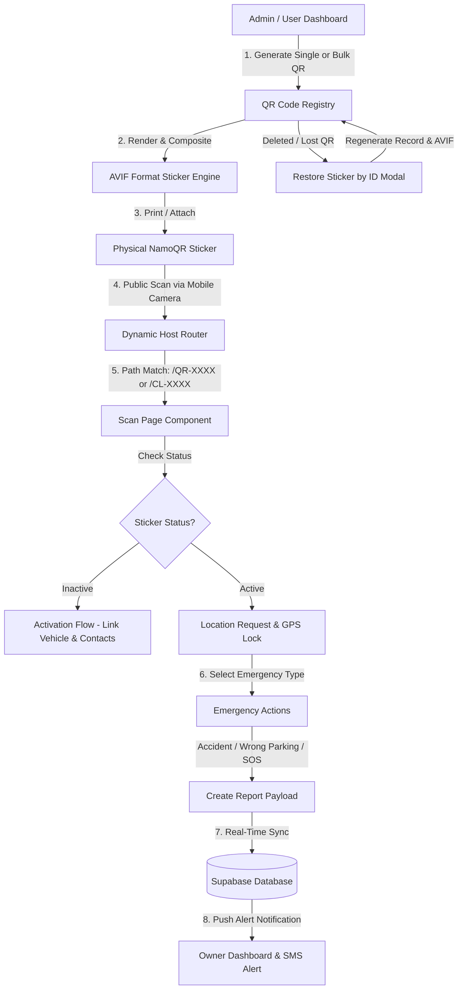

# NamoQR — Full System Flow & Data Collection Architecture

> **Complete documentation detailing how NamoQR operates, the end-to-end user & scan workflows, data collected at each stage, privacy safeguards, and database integration.**

---

## 1. Executive Summary & Purpose

**NamoQR** is a privacy-first smart QR safety sticker system for vehicles, home gates, luggage, keychains, and family members. It enables anyone (bystanders, traffic police, couriers, first responders) to contact a vehicle or property owner immediately during an emergency (wrong parking, accident, medical emergency, gas leak) **without publicly revealing personal phone numbers or private contact details**.

---

## 2. Complete End-to-End System Flow

---

## 3. Detailed Workflow Steps

### Step 1: Sticker Fleet Creation & Customization
1. **Generation**: Administrators or users generate single or bulk QR codes (`QR-8A3F`, `CL-CXTF2`) in the **QR Fleet Dashboard**.
2. **Templating**: Select background colors, foreground accent colors, and sticker placement coordinates (`stickerPos`).
3. **AVIF Export**: The canvas compositing engine generates high-efficiency **AVIF stickers** (`image/avif`) for printing or digital download.
4. **Database Sync**: QR entries (`id`, `client_id`, `status`, `template_name`, `fg_color`, `bg_color`) are saved to Supabase `qr_codes` table.

---

### Step 2: Customer Registration & Product Assignment
1. **Linking**: When a customer buys or activates a sticker, it transitions from `inactive` to `active`.
2. **Product Profile**: Assigned to a specific category (Car, Bike, Home Gate, Luggage, Keychain, Child, Senior, Pet).
3. **Detail Population**: User configures emergency instructions, vehicle numbers, blood group, allergies, and family contacts.

---

### Step 3: Public QR Scan Flow
1. **Scan Trigger**: A bystander or traffic officer scans the physical sticker using a smartphone camera.
2. **Dynamic Origin Resolution**: The URL (`http://localhost:3000/QR-8A3F` in local dev or `https://namoqr.com/QR-8A3F` in production) routes directly to the app scanner component without domain mismatch.
3. **Routing**: `App.tsx` regex detects `/QR-XXXX` or `/CL-XXXX` paths and loads `ScanPage.tsx`.

---

### Step 4: Emergency Alerting & Bystander Actions
When scanned, the reporter can perform immediate quick actions:
- **📞 Contact Owner**: Triggers in-app masked alert notification.
- **💬 Send Message**: Sends pre-formated SMS text with vehicle registration number.
- **📍 Share GPS Location**: Captures scanner's live GPS coordinates (`latitude`, `longitude`, `accuracy`) and embeds Google Maps link.
- **🚨 Send Emergency Alert**: Creates an emergency report event in `reports` table.

---

### Step 5: Real-Time Sync & Owner Notification
1. Emergency report is saved to Supabase `reports` table with status `unread`.
2. Live counter updates on the vehicle owner's dashboard under **Alerts & Notifications**.
3. Owner can acknowledge or mark alerts as `resolved`.

---

### Step 6: Sticker Restoration Flow (ID Regeneration)
1. If a physical sticker is damaged, lost, or accidentally deleted from the database, the user clicks **"Restore by ID"**.
2. Entering the original ID (e.g. `QR-8A3F` or `CL-CXTF2`) recreates the exact record in Supabase & local state.
3. Re-generates and downloads the exact AVIF sticker image ready for re-printing.

---

## 4. Complete Data Collection Matrix

| Data Category | Specific Data Fields Collected | Purpose & Usage | Storage Location | Privacy & Protection Level |
| :--- | :--- | :--- | :--- | :--- |
| **Owner Profile** | • Full Name • Email Address • Phone Number • Avatar URL • Subscription Plan | Owner identification, dashboard access, and account management. | Supabase `profiles` table & Supabase Auth | Encrypted at rest. Protected by Row Level Security (RLS). Never shown publicly to scanners. |
| **Vehicle & Item Details** | • Make, Model, Year, Color • License Plate / Reg Number • House / Apartment Profile • Travel Mode status | Identifies the specific vehicle or property associated with the QR code. | Supabase `products` table (`details` JSONB column) | Visible on emergency scan page only when sticker is in `active` status. |
| **Medical & Emergency Data** *(Keychains / Bags)* | • Blood Group • Medical Conditions • Allergies • SOS Contacts (Name, Phone, Relation) • Guardian & Parent Email | Enables first responders to provide immediate medical assistance in accidents. | Supabase `products` table (`details` JSONB column) | Opt-in emergency data shown strictly when SOS scan occurs. |
| **Scan Reporter Data** *(Bystander)* | • Live GPS Coordinates (`lat`, `lng`, `accuracy`) • Timestamp • Reporter Phone Number *(Optional)* • Emergency Type & Custom Message | Allows vehicle owner to locate vehicle (e.g. towed, accident location) and reply. | Supabase `reports` table (`location` JSONB column) | Anonymous by default unless reporter voluntarily provides phone number. |
| **QR Code Fleet Registry** | • QR Code ID (`QR-XXXX`) • Client ID (`CL-XXXX`) • Sticker Status (`active`/`inactive`) • Scan Counter & Timestamps • Template colors (`fg`, `bg`) | System fleet management, scan analytics, and sticker restoration by ID. | Supabase `qr_codes` table | Public read for QR validation; write access restricted to authenticated users. |

---

## 5. Security, RLS Policies & Performance Architecture

### Row Level Security (RLS) Policies
- **Cached Subquery RLS**: Uses `(select auth.uid())` and `(select auth.role())` cached subqueries to ensure zero per-row SQL function overhead during query execution.
- **Owner-Only Read/Write**: Product records and user profiles are viewable and editable strictly by their respective `user_id`.
- **Public Emergency Creation**: Anyone scanning a valid QR sticker can insert a record into `reports` without needing to log in.

### Database Indexing Strategy
- **`idx_products_user_status`**: B-Tree composite index on `(user_id, status)` for instant dashboard rendering.
- **`idx_qr_codes_status_created`**: Composite index on `(status, created_at DESC)` for fleet sorting.
- **`idx_reports_unread`**: Partial index on `(status, created_at DESC) WHERE status = 'unread'` for zero-latency alert notifications.

### Performance & Payload Optimization
- **Targeted Field Projections**: All API fetches select explicit required columns (e.g., `select('id, client_id, status, scans_count...')`) instead of heavy wildcard fetches (`select('*')`).
- **AVIF Image Format**: Image engine uses `image/avif` encoding with 50%+ file size reduction compared to PNG for ultra-fast mobile loading over cellular networks.

---

## 6. Emergency Report Types Supported

1. 🚗 **`accident`**: Collision / vehicle crash emergency alert.
2. 🛑 **`wrong_parking`**: Vehicle blocking driveway, gate, or no-parking zone.
3. 📞 **`contact_owner`**: General request to contact vehicle owner.
4. 🩺 **`medical_emergency`**: SOS health emergency alert for keychain / wristband scans.
5. 🔥 **`fire_emergency`**: Vehicle or property fire hazard notification.
6. 💧 **`water_leakage`**: Home gate sticker alert for pipe bursts / flooding.
7. ⚡ **`gas_leakage`**: Home / property gas leak alert.
8. 🛡️ **`security_alert`**: Theft detection / open window alert.
9. 📦 **`courier_arrival`**: Delivery agent ping for home gate sticker.
10. 🚪 **`visitor_notification`**: Visitor arrival ping.
11. 🧳 **`lost_luggage`**: Airport / travel luggage recovery ping.
12. 🔑 **`lost_key`**: Lost keychain owner alert.
13. 👶 **`lost_child`**: Child school bag / wristband emergency alert.
