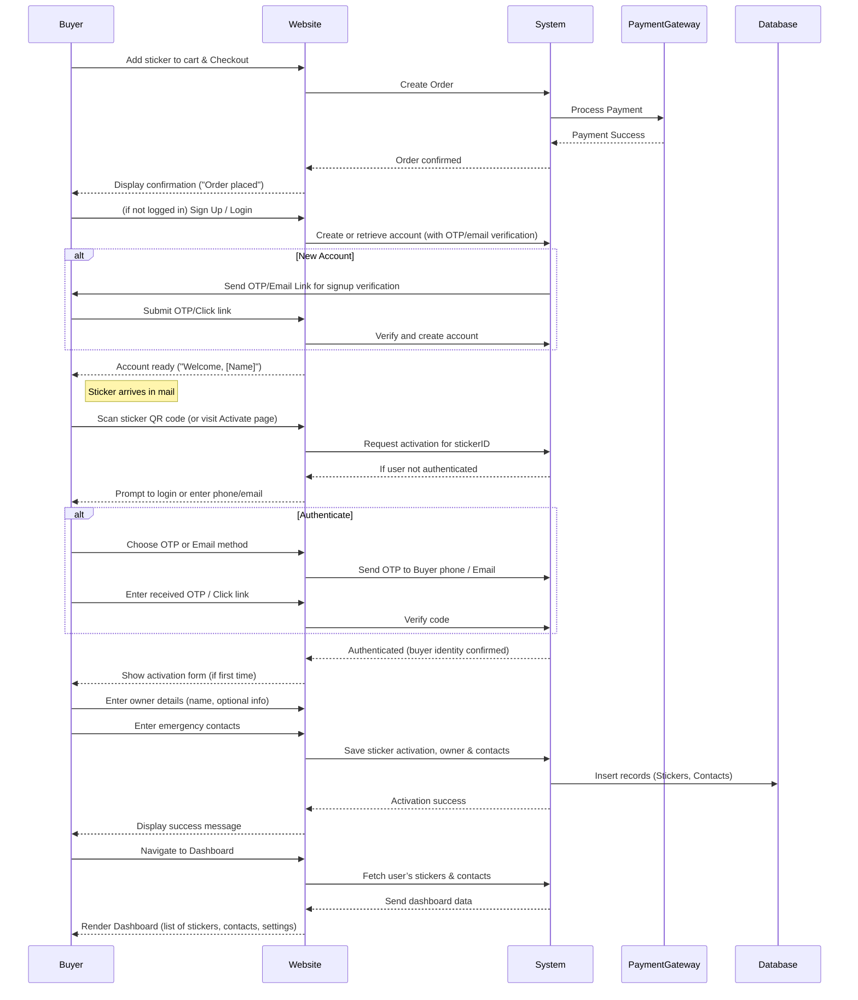

# Executive Summary  
A seamless post-purchase journey is critical for RepiQR: from ordering a sticker on the website, through activation, to the user dashboard. We propose a flow where buyers create or link an account at checkout, then **activate** their sticker by scanning its QR code or entering its code on the site/app. The system will verify the owner’s phone (via OTP or email), collect minimal personal info and emergency contacts, then mark the sticker as active. After activation, the user lands in a personalized dashboard showing all their stickers and contacts, allowing edits as needed.  

We compare activation methods (e.g. OTP via purchase phone vs. new phone, email link, pure QR) in terms of usability and security. The data model will use tables for users, stickers, and emergency contacts (with fields like sticker ID, owner ID, contact name/phone, activation status, timestamps). We emphasise privacy and security: gathering only consented personal data under India’s DPDP Act/GDPR standards, encrypting sensitive fields, and following OWASP/NIST authentication guidelines. UX best practices include minimizing form fields upfront (progressive profiling), using clear error messages and mobile-friendly inputs (e.g. SMS OTP autofill), and showing trust signals (SSL lock, privacy links) during signup.  

Diagrams and tables below detail the step-by-step flow (with decision branches), compare activation approaches, specify a database schema, and sketch the sequence of interactions. We also outline an implementation checklist and feature roadmap with priorities. Throughout, we focus on increasing conversion (simple forms, guest checkout), building trust (clear consent, secure processes), and designing a premium, scalable user experience.  

## User Journey: Purchase to Dashboard  
**1. Purchase & Account Setup:** The buyer adds a sticker to cart and checks out. We should offer both **guest checkout** and account creation. Guests proceed with minimal info (name, address, payment) and are then **prompted to register or log in immediately after purchase**. For example, after payment success, show a message like “Create an account to activate and manage your sticker!” with a one-click sign-up (pre-filling email from order). If the buyer already had an account (recognized by email/phone), the sticker order is linked to it. *UX Note:* Minimize friction here – allow quick checkout, then nudge registration. Only ask for essentials at checkout (shipping/payment). Use a trusted payment gateway logo and clear security indicators to boost conversion and trust.  

**2. Sticker Delivery & Activation Prompt:** Once the physical sticker arrives, it includes a unique QR code (and printed ID). The user is prompted to activate it. They either **scan the QR code** or manually go to the website/app and enter the sticker’s ID. The QR should encode a link like `https://repiqr.com/activate?sticker={ID}`. Scanning opens this link on their phone. If the user is **not logged in**, they are redirected to a login/registration step; if they are already logged in, it proceeds to activation. *UX Note:* The activation page should clearly show the sticker ID (to confirm it), and friendly instructions. Use large tap targets (“Activate Sticker”) and clearly labelled fields. Provide an “I’m not the buyer” note if, for example, someone gifts a sticker – clarify who the “owner” should be (the person carrying/using the sticker).  

 *Fig: Example of a mobile app scanning a QR code to activate a sticker (illustrative). Scanning the sticker’s QR triggers the registration flow on the device.*  

**3. Authentication Choice:** At activation, the system must verify identity. We should support **multiple auth methods**:  

- **SMS OTP** (to phone): If the buyer used their phone at purchase and it matches the intended owner, we can auto-send an OTP to that number. Otherwise, allow entering a different “owner phone” and send OTP there. *Security:* SMS OTP is widely used and convenient, though it has SIM-swap risks. To mitigate, we keep OTP validity short (e.g. 5 minutes) and limit attempts. *UX:* Autofocus the OTP field and enable SMS autofill on mobile. Indicate when the code is sent (“We’ve sent a 6-digit code to +91-XXX”). Provide a clear resend link if needed.  
- **Email Magic Link/OTP:** Offer email verification as an alternative, especially for users who prefer it or lack a phone. Send a one-time link or code to their email. *Pros:* It works cross-device and avoids SMS issues. *Cons:* Less instant, may get delayed. *UX:* After submitting activation, display “Check your email for a link” and let user continue to dashboard in limited mode if possible (pending verification).  
- **Third-party login:** (Optional) For future scalability, social logins (Google, Facebook) or “Login with phone (Authgear style)” could be added, but initially keep it simple with phone/email.  

*Decision Branch:* If both buyer and activation phone are the same, skip re-entry: auto-fill or skip OTP. If a new phone is used, require OTP on that phone. If SMS fails (no reception), allow switching to email. Always offer “Forgot phone?” to use email instead.  

**4. Register/Collect User Details:** Once authenticated, collect any remaining details. At minimum, record the owner’s name and preferred contact (phone/email). Use **progressive profiling**: only ask essential fields upfront, so as not to overwhelm users. For example:  

- **Owner Name (optional):** We can autofill this from account signup. If missing, ask.  
- **Product/Vehicle Info (optional):** e.g. “Vehicle number/model” or “Home address” if relevant, for personalized info. Mark optional to avoid drop-off.  
- **Consent checkbox:** Explicitly get consent to store and use this data (GDPR/DPDP compliance). Link to Privacy Policy. State clearly: “We’ll use this info only for your safety notifications.” *Privacy Note:* All data collection requires clear purpose and consent. 

*UX Tip:* Show a progress indicator (“Step 2 of 3: Your Details”). Use simple language (“What is your name?”) and friendly placeholders. Validate formats inline (e.g. phone number format).  

**5. Emergency Contacts:** Next, prompt to add emergency contacts. Require at least one (so a scanner can notify someone). Fields: “Name, Relationship, Phone”. Allow multiple contacts. You may enable importing from phone contacts if on mobile app (for convenience). *Security:* Treat contacts as personal data – store securely and only share during an actual scan event. *Compliance:* Under DPDP/GDPR, ensure contacts have consented or that their data is used only in an emergency context (legitimate interest). Include a small note: “We will notify these people with your info in an emergency.”  

*UX Best Practice:* Provide default labels (“Mother, Father, Partner, Doctor”), but let the user type freely. Validate phone numbers. Clearly show “Add another contact” button. Allow editing/deleting contacts. Make this step optional but strongly encouraged. Provide sample scenarios (“In an accident, these contacts will be alerted”).  

**6. Activation Confirmation:** After collecting contacts, finalize activation. The system marks the sticker as **activated** in the database and timestamps it. Send a confirmation message (SMS/email) to the owner: e.g. “Your RepiQR sticker is now active! You can manage it on your dashboard.” Also send a sample “test scan” email to show what responders see. *UX:* Show a success screen: “All set! Your sticker is active.” Offer a tour link or “Go to Dashboard” button.  

**7. Dashboard Access & Management:** Once activated, the user reaches their **Dashboard**. The Dashboard should list **all stickers** registered to this account (allowing multiple stickers). For each sticker, show its ID (or alias), activation date, status (active/inactive), and actions. Actions include: **Edit Details**, **Edit Contacts**, **View Scan History**, **Deactivate/Transfer**.  

- **Emergency Contacts Section:** User can add, edit or remove contacts at any time. Show an “Add Contact” button and list existing contacts. Use inline editing or modals.  
- **Account Settings:** Allow changing the owner’s phone/email/password. Include security options (2FA setup).  
- **Support & Legal:** Link to Privacy Policy, terms, and provide customer support contacts (for lost sticker, fraud, etc).  

*UX Notes:* Keep the dashboard clean and mobile-responsive. Use card or table layouts for stickers. For editing contacts/details, use clear forms with “Save”/“Cancel”. Confirm destructive actions (e.g. “Are you sure you want to deactivate this sticker?”). Show subtle trust signals (e.g. “Your data is encrypted”) somewhere.  

**8. Administrator Role:** As a third actor, an admin panel should allow RepiQR staff to view orders, manage activations, and assist users (especially for edge cases like lost phones). The admin dashboard would list user accounts, sticker IDs, and provide search by phone/email/sticker ID. Admins can manually trigger OTPs or transfer ownership on behalf of the user. This is outside the user’s flow but important for support. *Security:* Admin access must be highly restricted and audited.

**9. Edge Cases & Error Handling:**  

- *Lost/Changed Phone:* If the owner’s phone is lost, allow login via email and change the phone number after verifying identity (OTP on new phone, or support verification). Offer recovery codes or security questions as backup.  
- *Transfer Ownership:* Provide a “Transfer Sticker” feature. For example, the current owner can initiate transfer by entering the new owner’s phone. The system sends OTP to the new phone and confirmation to the old one. Once confirmed, reassign the sticker ID to the new user account. Log this event.  
- *Multiple Stickers per Account:* No limit needed – a family might have many. Allow users to add new stickers from their dashboard by scanning or entering code.  
- *Inactive/Expired Stickers:* If a sticker is reported lost or the user quits, allow deactivation. Once deactivated, scanning could show “inactive sticker” message.  
- *Payment Failure:* If purchase payment fails, clearly inform user and let retry. Don’t proceed to activation until order is confirmed.  
- *Validation Errors:* Show inline, specific error messages (e.g. “Invalid OTP, try again”). Always allow resending OTP/email.  
- *Connectivity Issues:* For mobile flow, display a fallback (“If you can’t scan, visit repiqr.com/activate”).  

By anticipating these cases and designing clear UX (informative messages, fallback options), we ensure the system is robust and user-friendly. Overall, this flow maximizes conversions (quick checkout, simple activation) and user trust (transparent steps, data consent, secure auth), aligning with RepiQR’s goals of a premium D2C experience.

## Activation Approaches Comparison  

We compare several ways to authenticate/activate the sticker. Key criteria: ease-of-use (UX), security, and implementation complexity.  

| **Activation Method**               | **Pros**                                                    | **Cons**                                                         | **Security**                                   | **UX Considerations**                                      |
|-------------------------------------|-------------------------------------------------------------|------------------------------------------------------------------|-----------------------------------------------|-----------------------------------------------------------|
| **SMS OTP to Buyer’s Phone**        | Instant, leverages existing purchase info; user only needs to tap OTP.   | Inconvenient if user scans on a different device; phone might be lost or SIM-swapped.   | Moderate. SMS OTP is common, but vulnerable to SIM attacks. Must limit attempts. | User stays on phone that made purchase – seamless if same device. Requires waiting for code. |
| **SMS OTP to Any Phone (User-provided)** | Flexible (user can enter any number); ensures correct “owner” is verified. | Extra step to enter number; potential friction.   | Same SMS vulnerabilities. Avoid if number reused maliciously. | Slightly more friction (entering number, waiting on another device), but covers use-cases like gifting a sticker.|
| **Email Magic Link/OTP**            | Works across devices; no phone needed.                      | Slower (email delays); user must switch apps; might hit spam.    | Moderate. Security depends on email provider; links could be forwarded.   | Not as instant. Can continue to limited dashboard while waiting for link. |
| **QR Scan Only (no login)**        | Fastest path: just scan and fill info. No account needed.    | No account linkage; anyone with the sticker could re-activate or overwrite data.  | Poor. No proof of ownership – risks someone else claiming the sticker.       | Very simple for first scan, but breaks trust since no way to manage later. |
| **QR + Code (Manual Key)**         | Ties activation to physical sticker (need the code); no separate OTP. | If code is obtained by others (e.g. photographing sticker), can be misused.   | Low. Code acts like a PIN – better than nothing but easily leaked.  | Adds step: user must find and type the code. Might confuse non-tech users.  |
| **Pre-Login “Add Sticker” (Account first)** | User already logged in, then enters/scans code.   | Requires user to have an account *before* receiving sticker. | Good, relies on account security (password, MFA).   | Slightly more work upfront (creating account earlier), but gives best management experience. |

- *Recommendation:* Offer **SMS OTP** by default (it’s most user-friendly) and fall back to email if needed. Always require **some verification** – we should avoid a “scan-only” path without an account. Using the user’s phone from purchase (if available) can streamline activation, but always allow entering a new phone. In all cases, proceed to collect details only after authentication. This balances security (verifying ownership) with UX.

## Data Model (Database Schema)  

We recommend the following tables and fields. Primary keys (`id`) should be random/UUIDs to prevent guessing. Timestamps (`created_at`, `updated_at`) track history.  

**Users Table:** (stores each account/buyer)  
| Column         | Type         | Description                              |
| -------------- | ------------ | ---------------------------------------- |
| user_id (PK)   | UUID/varchar | Unique user identifier (random UUID) |
| name           | varchar      | User’s full name                         |
| email          | varchar      | Email (unique); used for login or contact |
| phone          | varchar(15)  | Primary phone number (unique)            |
| password_hash  | varchar      | (optional) Hashed password if using password login |
| created_at     | datetime     | Account creation timestamp               |
| updated_at     | datetime     | Last profile update time                 |

**Stickers Table:** (each sticker sold)  
| Column            | Type         | Description                              |
| ----------------- | ------------ | ---------------------------------------- |
| sticker_id (PK)   | varchar      | Unique sticker/QR code ID (printed on sticker) |
| owner_user_id (FK)| UUID        | References Users.user_id (who owns it)   |
| activated        | boolean      | Activation status (true/false)           |
| activated_at      | datetime     | When it was activated                    |
| deactivated_at    | datetime     | If transferred/lost, when flagged inactive |
| created_at        | datetime     | When sticker was sold/recorded           |
| updated_at        | datetime     | Last detail update                       |

**EmergencyContacts Table:** (contacts for alerts)  
| Column        | Type        | Description                                  |
| ------------- | ----------- | -------------------------------------------- |
| contact_id (PK)| UUID/varchar| Unique contact ID                            |
| sticker_id (FK)| varchar    | References Stickers.sticker_id               |
| name          | varchar     | Contact’s name                               |
| phone         | varchar     | Contact’s phone number                       |
| relationship  | varchar     | E.g. “Spouse”, “Parent”                       |
| added_at      | datetime    | When contact was added                       |
| updated_at    | datetime    | When contact info was last changed           |

*(Optional) ScanLogs Table:* For analytics – records each time a sticker is scanned. Fields: log_id, sticker_id, scanned_at, location (if available). This helps show “last scan” on the dashboard and analytics. 

**Security Notes:** Encrypt or hash sensitive fields (e.g. passwords). PCI compliance governs any payment info (though that may be handled by a payment gateway). Do not store full OTP codes. Comply with DPDP/GDPR by keeping personal data minimal, and supporting deletion (“right to be forgotten”).  

## Sequence Diagram (Activation Flow)  
Below is a Mermaid sequence diagram of the main interactions (purchase to activation). It shows the Buyer (user), the Website/App (front-end), and the Backend System. This includes branches for login vs registration and OTP verification.  

This illustrates the **decision branches** (new vs existing account, OTP vs email) and the data flow. In practice, the Website and System may be unified (web frontend & backend), but we separate for clarity.  

## Dashboard Wireframe Description  

The user’s **Dashboard** (web/app) is the central hub to manage stickers and contacts. A clean layout might include:  

- **Header/Toolbar:** Shows user name, notifications icon (e.g. pending scans), and a “+ Add Sticker” button. Also links to Settings and Logout.  
- **Sidebar (or top tabs):** Sections: **My Stickers**, **Emergency Contacts**, **Account Settings**, **Support**. (Or if one section view, a button to toggle to contacts.)  
- **Main Area (My Stickers):** A list or grid of sticker cards. Each card displays:
  - *Sticker ID/Name* (possibly user-customizable alias, like “Car Sticker”)
  - *Status:* Active (green) or Inactive (grey).
  - *Activated On:* date.
  - *Last Scan:* e.g. “3 days ago” or “Never”.
  - *Actions:* [Edit Details], [Edit Contacts], [Share Sticker], [Deactivate]. Icons or small buttons.  
  Users click **Edit Details** to change owner info or sticker label. **Edit Contacts** opens the contact list for that sticker. **Share Sticker** could copy the sticker’s unique activation URL (for lending or backup).  

- **Emergency Contacts Section:** If separate, shows a table of all contacts (optionally grouped by sticker). Columns: Name, Phone, Sticker (which sticker they belong to). Buttons to **Add Contact** or **Edit**. Adding opens a modal form (“Name, Relationship, Phone”). Inline validation as user types.  

- **Account Settings:** Form to update user name, email, phone, and change password. Option to set 2FA. Also links to Privacy Policy, and a “Delete Account” action.  

- **Footer/Policy Links:** Always visible: “Privacy Policy” and “Terms of Service” links.  

*Mockup Style:* Use a clean, modern UI with consistent branding (RepiQR logo/colors). Use cards or table stripes for readability. For mobile, a stacked view: Sticker list first, then contacts. Include tooltips or help icons (e.g. “?”) for fields like “QR Code: a unique code on your sticker”.  

> *Example Scenario:* On login, the user sees one sticker card: “Car Sticker #1234 – Active since 2026-07-30”. They click **Edit Contacts**, and a side panel slides out listing “Mother (98765…), Father (91234…)” with [Delete] icons. They hit “Add Contact”, type a name and number, and hit Save. The list updates immediately.  

This intuitive design lets users quickly verify and update their emergency info. Clear button labels and confirmation dialogs ensure users don’t lose data accidentally. Feedback messages (snackbars) confirm actions (“Contact added!”). The overall dashboard flow adheres to UX best practices for usability and trust (see Authgear and Linkbreakers on clear labels and minimal steps).

## Implementation Checklist & Roadmap  

**Immediate (High Priority):**  
- **User Account & Authentication:** Implement user signup/login with phone/email (OTP or password). Effort: Medium. Use a proven identity solution or framework. Ensure phone/email uniqueness. Add SSL for all auth pages.  
- **E-commerce Checkout:** Set up product pages and cart with payment gateway (support multiple India options: UPI, cards, wallets). Effort: Medium. Optimize checkout form (minimize fields, auto-fill). Mark as high priority to capture sales.  
- **Sticker Order Management:** Generate unique `sticker_id` codes for each order. Link orders to user accounts. Effort: Low. Simple DB operations.  
- **Activation Flow:** Build the activation endpoint that handles QR scans. This includes redirect logic to login/OTP and then to data collection form. Effort: Medium.  
- **OTP/Email Integration:** Integrate SMS (Twilio/Notifyre) and email services. Ensure OTP expiry and rate-limiting. Effort: Medium. Critical for trust/security.  
- **Minimal Data Collection Forms:** Design the short registration and contact forms as per UX guidelines. Implement front-end validation and privacy consent checkbox. Effort: Low.  

**Short-Term (Next 1-2 Months):**  
- **Dashboard Front-End:** Build the user dashboard (stickers list, contact list, settings). Effort: High (involves multiple UI components). Focus on a responsive, branded design.  
- **Database Schema & Backend Logic:** Create tables for Users, Stickers, Contacts (as above). Implement CRUD APIs for adding/editing stickers and contacts. Effort: Medium. Ensure referential integrity (FKs) and indexing.  
- **Privacy & Compliance:** Draft and publish Privacy Policy. Add consent flows on forms. Implement data retention and delete-account features (DPDP/GDPR compliance). Effort: Low/Medium. Legal review recommended.  
- **Email/SMS Notifications:** Automate sending activation confirmations and alerting contacts. Effort: Low. Ensure opt-in and opt-out as required.  
- **Error Handling & UX polish:** Thoroughly test flows. Add user-friendly error messages and loading states. Effort: Medium.  

**Medium-Term (3–6 Months):**  
- **Multi-Sticker Support:** Enhance the dashboard to handle multiple stickers per user. Implement “Add Sticker” in the dashboard. Effort: Medium.  
- **Transfer & Recovery Flows:** Build UI for transferring ownership and recovering accounts (lost phone). Effort: Medium.  
- **Analytics & Reporting:** Log scan events (count, time, location). Show “Scan History” or map if applicable. Effort: Low. Use for future features/marketing.  
- **Admin Panel:** Develop an internal admin interface to view users/orders/stickers, and assist with transfers or deactivations. Effort: Medium. (Could be simplified at launch and expanded later.)  

**Long-Term (6+ Months):**  
- **Mobile App (if not already):** A native app for Android/iOS (they mentioned it’s under development). This would enhance UX (access to contacts, notifications). Effort: High.  
- **Additional Auth Options:** E.g. “Login with Google/WhatsApp” or passkeys, once user base grows. Effort: Low to Medium.  
- **Advanced Features:** E.g. SOS button in app, geolocation alerts, subscription management, etc. Effort: High (depending on scope).  

Each feature is marked **Effort:** Low/Med/High based on development complexity. We prioritize core flows (account auth, activation, dashboard CRUD) first, as these directly impact user conversion and trust. Subsequent features (analytics, admin tools) are valuable but lower priority for MVP. Throughout, iterative testing and user feedback should guide refinements.  

**Summary:** By following this roadmap—building from purchase to activation to dashboard—we ensure a robust, user-friendly system that upholds security and privacy standards (e.g. DPDP Act’s consent and purpose limitations) while delivering a premium user experience focused on ease of activation and management.