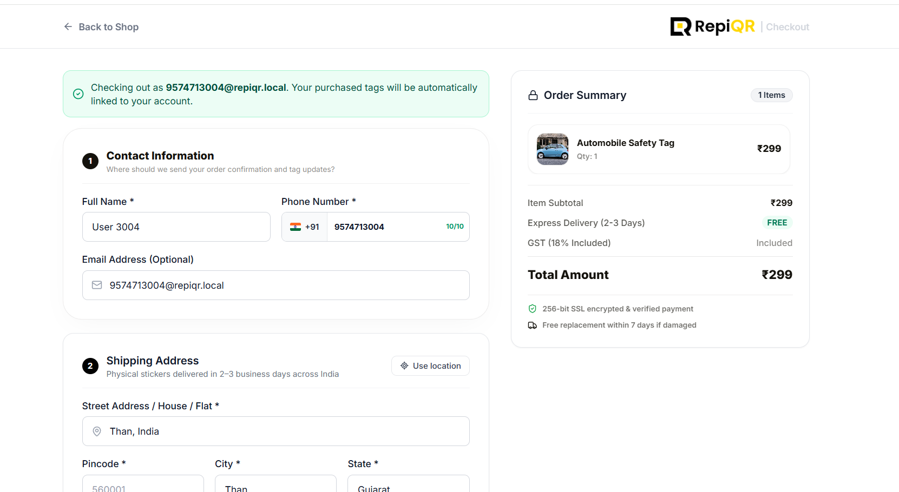

in client dashboard top side top pannel add my balance show that show balance that pay for ths sticker 

make client dashboard more simpler and respossive for the mobile devices 

if user pay show balance from paid status by razor pay , balance based stucture , and sticker card no price and button must be get free , when  user click th butn in checkout page total amount must be 150 Rupee , that 150 rupee show txt add too your blanace , 

 basically nomral sticker is free but if you want to use then pay balance 150rupee 

 

 adn in green message in checkout page green message show  "Your sticker is free" like improved message .

 